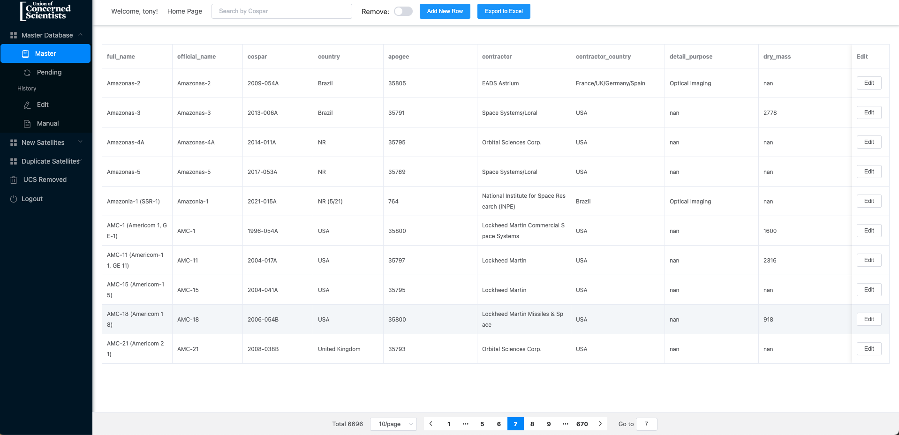

# Skynet
## UCS Satellite Database

## Overview

The UCS Satellite Database is the premier free and openly accessible database cataloging all of the over 5,000 actively operating satellites. It provides a detailed record of 28 different aspects of each satellite, from its launch details, orbit position, to its functionality. The database is a fundamental tool for space professionals, researchers, journalists, and satellite enthusiasts. As the pace of satellite launches is surging rapidly with organizations like SpaceX and One Web planning satellite constellations numbering in tens of thousands, there's an increasing need to automate the data collection and verification process. We aim to integrate automation in data collection and also explore innovative ways to present data using images and tables for users who may not be technically inclined.

## Technologies Stack
- Python
- Vue
- Electron
- Scrapy
- Selenium
- BeautifulSoup4
- PostgreSQL

## Setup
There might be some formatting issues when running the program on a Windows machine, it is **strongly recommended** to 
run this program on a **macOS** or **Linux** environment.

**Note:** If it's necessary to run on a Windows environment, there will be things needed to be modified in the codebase.
1. Look into `./skynet_scrapy/myspider/myspider/pipelines.py` and switch every line of `value = parsed_date.strftime('%-m/%-d/%y')` 
to `value = parsed_date.strftime('%m/%d/%y')`.
2. Look into `./skynet_scrapy/myspider/myspider/spiders/thespacereport.py` and modify the `service = Service(executable_path="chromium.chromedriver")` line. Change the `executable_path` to specify the path to chromedriver.exe driver that's downloaded on the machine. An example, `executable_path=r"C:\path\to\chromedriver.exe"`
```bash
# installing virtual environment (recommended, not required), may need --user flag
py -m pip install --user virtualenv

# create new venv environment (do in backend folder)
python -m venv <VirutalEnvName>

# starting venv in windows with powershell/visual studio terminal
Set-ExecutionPolicy -ExecutionPolicy Unrestricted -Scope Process venv\Scripts\Activate.ps1

# starting venv on mac
source myvenv/bin/activate

# Install all required packages
python Packages.py
```

## Run
```commandline
# open virtual environment
source myvenv/bin/activate  cd flask_backend && python app.py
cd vue-frontend && npm run serve
cd CS639Skynet
cd skynet_scrapy/myspider && python skynet.py
```

## Database Setup
**Only for local users!!!** If you are using the remote database, you can skip this section.
### Prerequisites
- PostgreSQL database installed. 
- Necessary permissions to access the database, typically as the postgres user.

To configure PostgreSQL with a new user and database:

1. **Log in as `postgres` user**
   Use the command: 
   ```bash
   psql -U postgres
   ```

2. **Create a New User**
   Create a user named `skynetapp` with the password `skynet`:
   ```sql
   CREATE USER skynetapp WITH PASSWORD 'skynet';
   ```

3. Create a Database
Create a database named skynetapp and assign it to the user:
    ```sql
    CREATE DATABASE skynetapp OWNER skynetapp;
    ```
4. **Grant Privileges**
    Grant all privileges on the database to the user:
    ```sql
    GRANT ALL PRIVILEGES ON DATABASE skynetapp TO skynetapp;
    ```
5. Test the setup
   Log out and reconnect to the database as `skynetapp` to confirm configuration:
   ```bash
   psql -U skynetapp -d skynetapp
   ```

For postgres, have a .env file in the root directory of the project with the following (replace with your credentials)
```python
#username
DB_USER='username'
#password
DB_PASSWORD='password'
#host
DB_HOST='host' #usually localhost
#port number
DB_PORT=5432
#database name
DB_NAME='databasename'
```

## About chromedriver on mac
Installing chromedriver can be tricky. Please follow these steps:
1. Go to https://googlechromelabs.github.io/chrome-for-testing/ to download the chromedriver for the version of chrome you are working with.<sup>*</sup>
2. Unzip and copy the chromedriver executable
3. Open finder and press cmd + shift + g. This will open a window where you can enter filepath addresses to hidden folders.
4. Navigate to `/usr/local/bin/` by entering /usr/local/bin/ in the address box. In case you don't have a `/usr/local/bin/`, enter /usr/local/ and create a bin directory in this folder and open it.
5. Paste chromedriver in `/usr/local/bin/``
6. In `./skynet_scrapy/myspider/myspider/spiders/thespacereport.py` Follow instructions starting on line 41 on how to configure your executable_path. If you are on mac and have followed the above steps, you are done setting up the chromedriver.

**Note:** You might run into an error when you run the scrapers for the first time, it happens because Apple blocks the execution of chromedriver binary by default. Please execute the following command in terminal:
```bash
sudo xattr -d com.apple.quarantine $(which chromedriver)
```

<sup>*</sup> Although not mandatory, but we recommend you download both the chromedriver and chrome/chrome-headless-shell from the website. Once you install chrome, you will have Google Chrome for Testing on your machine which runs seperately from your personal version of chrome. Please execute the command below if you install this:
```bash
sudo xattr -cr /Applications/Google\ Chrome\ for\ Testing.app
```

## About chromedriver on ubuntu
Installing chromedriver on Ubuntu is fairly straight-forward. Run the following commands:
```bash
sudo apt-get -y install xdg-utils
pip3 install selenium==4.1.2 lxml html5lib
sudo apt -y install chromium-browser
```

**Note:** In `./skynet_scrapy/myspider/myspider/spiders/thespacereport.py` Follow instructions starting on line 41 on how to configure your executable_path.

## Overview of Project
### Home Page

### Edit

### Remove

### Add New Row

